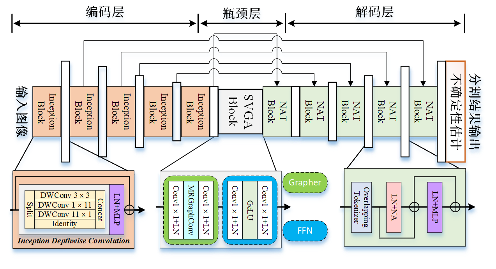
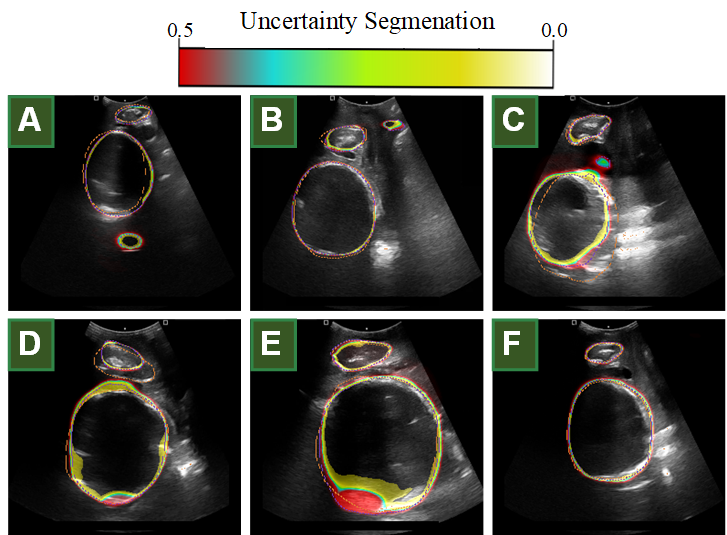

# Uncertainty-Fetal Head and Pubic Symphysis Segmentation with Enhanced Multi-Scale Features and Sparse Visual Graph Attention

Official pytorch code for "Uncertainty-Fetal Head and Pubic Symphysis Segmentation with Enhanced Multi-Scale Features and Sparse Visual Graph Attention"

- [✔] Code release
- [❌] Paper release

## Abstract
Accurate segmentation of the fetal head and pubic symphysis in intrapartum ultrasound images are crucial for prognosis prediction and complication prevention during delivery. However, due to the poor quality of intrapartum ultrasound imaging, blurred object boundaries, and strong artifacts, manual segmentation is time-consuming and laborious even for experienced experts, and current deep learning methods lack expressiveness and transparency, resulting in obstetricians' lack of confidence in the segmentation results. In this paper, a new method is proposed for the uncertain segmentation of fetal head and pubic symphysis in intrapartum ultrasound images. First, we introduce an improved Inception block in the encoder. Compared with traditional convolution operations, it helps the model obtain multi-scale features under different receptive fields while effectively reducing the amount of calculations. Second, we introduce a graph-based sparse attention method called Sparse Visual Graph Attention (SVGA). Compared with existing attention mechanisms, it is able to obtain the structure of the graph before inference. In addition, SVGA can avoid reshaping operations when performing graphics convolution to effectively reduce computational overhead. Then, in the decoder, we introduce the Neighborhood Attention Transformer (NAT). NAT can limit the self-attention range to adjacent pixels and adopt a sliding window mode to make the model achieve stronger time and space complexity. Finally, we use test-time augmentation to perturb the model input, evaluate the changes in the model for different inputs, and finally output an uncertainty measure. The effectiveness of our approach was validated through experiments on two datasets. Compared with existing methods, our model demonstrated competitive performance. The proposed model significantly improved automatic segmentation accuracy, reduced errors, and provided substantial support for ultrasound physicians in clinical settings.

### IGT-Net:

## Performance Comparison

## Environment

- GPU: NVIDIA GeForce RTX3090 GPU
- Pytorch: 1.10.0 cuda 11.4
- cudatoolkit: 11.3.1

